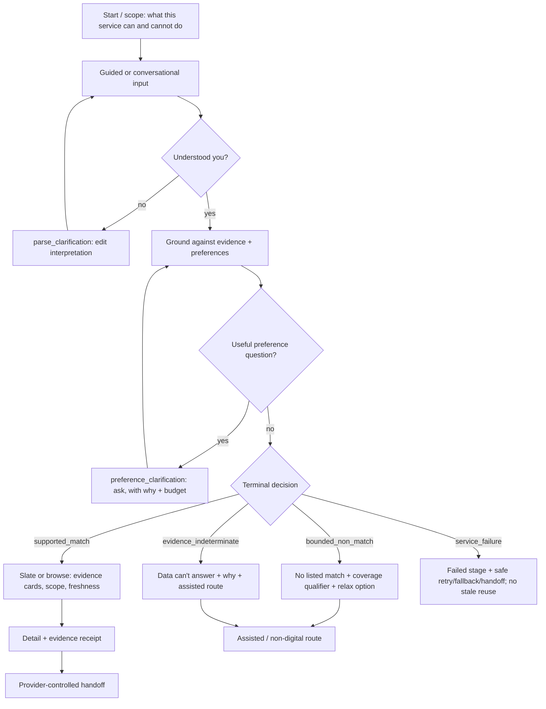

# C-02 — Actors, jobs and workflows (public application)

**Owner (proposed):** Clarence · **Review:** Wesley (integration) + partner route via supervisor (Section 18)
**Status:** **PROPOSED — DRAFT SCAFFOLD.** All actors below are **HYPOTHETICAL** until validated through the authorised partner route (`RATIFY-14-03`).
**Basis:** WP §4.3 (envelope variants), §7 (public application), §9.3 (UX distinctions), §11.4 (scenarios ≠ demographic personas), §12.3 (prohibited use).

> **Authorship notice.** AI-assisted scaffold; not evidence Clarence authored/accepted it. He must
> correct it in his own words and validate actors through the supervisor→partner route — **never
> contact London Sport directly** (unit-rules §3; WP §2.4). Until validated, no actor here may be
> cited as a partner-confirmed fact.

## 1. Actor discipline

Actors are **roles**, and needs are expressed as **requirement scenarios, not demographic personas**
(WP §11.4). "A wheelchair user" is not an actor; "a person who needs step-free access confirmed
before travelling" is a scenario that any actor may carry. This keeps the design barrier-informed
without inferring identity from data that does not encode it.

## 2. Public actors (all HYPOTHETICAL)

| ID | Actor | One-line goal | Status |
|----|-------|----------------|--------|
| `A1` | Person looking for an activity (self-serve) | Find activities that meet the constraints they confirm, and understand what the data can and cannot tell them | HYPOTHETICAL |
| `A2` | Assisted-pathway practitioner (e.g. community connector) helping a resident | Do the same on behalf of someone else, then hand off safely to the provider | HYPOTHETICAL |

Staff actors (London Sport analyst, etc.) belong to the **staff workbench (C-06)** and are out of
scope for this public dossier.

## 3. Jobs to be done (public)

For `A1`/`A2`:

1. **Express and confirm** what I need (hard must-haves vs soft preferences), and see that the
   system understood me (maps to `parse_clarification`, `preference_clarification`).
2. **Get activities that meet my confirmed must-haves**, in a transparent order (`discovery_decision`
   → `supported_match` + `authorised_slate` / `browse_only`).
3. **Understand a "no" honestly** — is there genuinely no listed match, can the data not answer, or
   was a component down? (`bounded_non_match` vs `evidence_indeterminate` vs `service_failure`,
   never merged — WP §9.3).
4. **See what the data can't confirm** for an option (unknown/conflicting fields) rather than being
   told a false certainty (`evidence_clarification`, evidence card §7.4).
5. **Get to the provider safely** (provider-controlled handoff link; no booking/payment here).
6. **Get help or a non-digital route** (assisted / telephone-compatible handoff).

## 4. Non-jobs — explicitly out of scope (WP §7.3, §12.3)

Booking, payment, referral, diagnosis, eligibility determination, safeguarding decisions; "best for
me" as a truth claim; live capacity/availability unless separately evidenced; demographic profiling
or inferring identity from origin; any account requirement for the public core.

## 5. Barrier scenarios → required route/fallback (WP §11, §7.1)

| Scenario | Required behaviour |
|----------|--------------------|
| Needs step-free access confirmed | `access=step_free` shown as a typed evidence state; `U` rendered as "not published", never "inaccessible" |
| Low bandwidth / no map | Full function on a **no-map** route; list is the primary, map is a secondary view |
| Cannot / prefers not to use chat | Full function on a **guided, non-chat** route |
| Screen-reader / keyboard only | Every state has a text equivalent; complete keyboard route (C-BLOCK-11) |
| Time-poor / interrupted | Deterministic guided route completes without the model; safe resume, no stale certainty |

## 6. Public journey (happy path + honest branches)

## 7. Failure and handoff paths

- **Service failure:** state the failed stage; offer retry, deterministic fallback or assisted
  handoff; **never** silently reuse a stale result (`service_failure` envelope; WP §7.3).
- **Provider handoff:** provider-controlled link only; the service never books, pays or refers.
- **Correction / issue token:** lets a user challenge an outcome; contains references only, **no raw
  dialogue and no exact location** (WP §9.4). Creates a staff investigation candidate; cannot mutate
  evidence or contact a publisher.
- **Assisted / telephone route:** printable and assisted-compatible handoff for `A2` or any scenario
  where the digital route is unsuitable.

## 8. Status / next

PROPOSED. Needs Clarence's own wording, and actor validation through the supervisor→partner route
(`RATIFY-14-03`); until then every actor stays HYPOTHETICAL and no usability/practitioner claim is
made. Feeds directly into C-04 (public information architecture) and the Phase D vertical slice.
