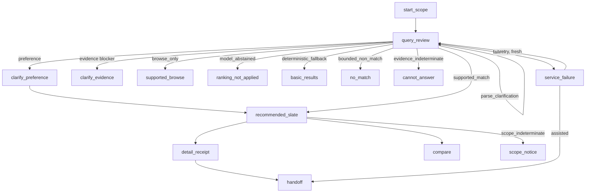

# C-04 — Public information architecture

**Owner (proposed):** Clarence · **Review:** Fahmi (evaluation parity) + non-author HCI reviewer (`RATIFY-14-05`, C-BLOCK-03)
**Status:** **PROPOSED — DRAFT SCAFFOLD.** Machine source: `packages/public-ia/public-state-machine.json`; validator: `validate_ia.py` (passing).
**Basis:** WP §4.3, §7.1–7.4, §9.3; enforces C-BLOCK-14 (order/abstention) and C-BLOCK-11 (fallbacks).

> **Authorship notice.** AI-assisted scaffold; not evidence Clarence authored/accepted it. He must
> correct it in his own words and obtain a non-author HCI review before it freezes.

## 1. Routes (§7.1)

Accessible **guided search** (chat-free, map-free); **conversational** discovery (never the only
route); **browse/list** without a profile; optional **map** as a *secondary* view (list is
authoritative); **compare**; **detail + evidence receipt**; and printable/assisted/telephone
**handoff**. Guaranteed fallbacks: a **non-chat** route, a **non-map** route, and a **no-JavaScript
core** for essential content and actions (C-BLOCK-11/14).

## 2. Screens and minimum obligations (§7.2)

| Screen | User question | Minimum obligation | Contract state covered |
|--------|---------------|--------------------|------------------------|
| start_scope | What can this service do? | Catalogue/AI/non-clinical boundary; expose help + non-chat route | — |
| query_review | Did it understand me? | Editable hard/soft constraints + confirmation | `parse_clarification` |
| clarify_preference | Why is it asking? | Preference question + budget + why it helps | `preference_clarification` |
| clarify_evidence | Why can't it answer? | Explain blocker; whether an answer can change anything | `evidence_clarification` |
| recommended_slate | What is recommended? | Authorised slate only; scope, freshness, evidence, abstention | `supported_match` + `authorised_slate` |
| supported_browse | What else meets my must-haves? | Labelled browse, not recommendation | `browse_only` |
| ranking_not_applied | Why no ranking? | Ranking not applied; offer deterministic/browse; **not** "no match" | `model_abstained` |
| basic_results | What can I still see? | Standard results without ranking | `deterministic_fallback` |
| no_match | Is there really nothing? | No listed match **within searched coverage** + relax option | `bounded_non_match` |
| cannot_answer | Can the data answer this? | Data can't answer; why; assisted route | `evidence_indeterminate` |
| scope_notice | How complete is this? | Surface incomplete scope even when a match exists | `scope_indeterminate` |
| service_failure | Something went wrong — now what? | Failed stage + safe retry/fallback/handoff; **no stale reuse** | `service_failure` |
| detail_receipt | Why was this shown? | Confirmed evidence, limits, ordering, source/vintage, next step | — |
| compare | How do options differ? | Retain unknown/conflict; no invented composite winner | — |
| handoff | How do I continue/challenge? | Provider-controlled next step; assisted option; minimal token | — |

The five outcomes that must be **visibly distinct** (WP §7.2, §9.3) — `supported_match`,
`bounded_non_match`, `evidence_indeterminate`, `scope_indeterminate` and `service_failure` — each map
to their own screen; the validator fails if any two collapse into one.

## 3. State machine

Defined in `public-state-machine.json` (15 screens, 18 transitions). `service_failure` may only
transition to a fresh `query_review` (retry) or `handoff` — never back into a results screen — so a
failure can never silently reuse a stale result (`no_stale_after_failure`).

## 4. Evidence card content (§7.4)

Each surfaced option progressively discloses: why it meets the confirmed must-haves; important
unknown/conflicting optional facts; whether collection/scope is incomplete; which confirmed
preferences affected order; whether evidence was explicit, schedule-derived or specification-default;
vintage/freshness and a public receipt id; and how to edit, challenge, get help or follow the
provider link. Design goal: **appropriate reliance**, not maximum trust.

## 5. Public prohibitions (§7.3)

No booking/payment/referral/diagnosis; no "best for you"/"safe"/blanket "accessible"; no live
capacity unless separately evidenced; no interleaving indeterminate candidates with recommendations;
**client sort/map/pagination may never change eligibility or certified order**; never hide scope
limits because one match exists; never reuse a stale result after failure without an unmistakable
warning; no unverified factual model text; no account for the public core.

## 6. Executable check

`validate_ia.py` reads the enums directly from the C-BLOCK-05 schemas and confirms: every
`action_kind`, `terminal_decision`, `recommendation_action` and `scope_indeterminate` has a covering
screen; the terminal experiences are distinct; the required routes and non-chat/non-map/no-JS
fallbacks exist; transitions are well-formed; and `service_failure` cannot flow into stale results.
Status: passing.

## 7. Status / next

PROPOSED. Needs Clarence's own wording, Fahmi's evaluation-parity review (so P0/P1/P2 map to real
screens), and a non-author HCI review (`RATIFY-14-05`, C-BLOCK-03). This IA is the blueprint the
Phase D deterministic public vertical slice implements.
